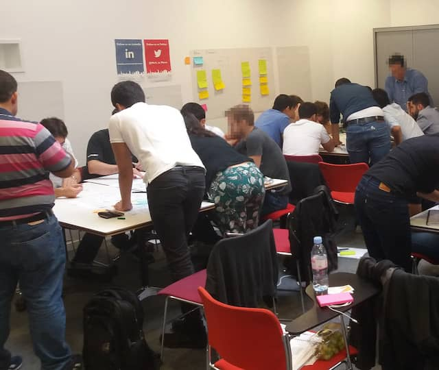

# Animation Guide for the Built-in Quality Game

This guide is aimed at the animator of the built-in quality game. It contains advices and tips to make your first session a success.

## Before the game

Just after you've presented the [rules](Rules.md) of the game, leave a few minutes to people to read their role and to get a grasp at the [rules](Rules.md). This is a good time to walk around and ask people if there is anything they did not understand.

## Blank run

The blank run is there to help everyone get at ease with the game [rules](Rules.md). Again, walk around and check that the game is played correctly.

## During the game

Experience shows that teams usually have a hard time being disciplined enough to stick to one improvement every 5 minutes. To help them, only distribute the improvement tickets (the red ones) every 5 minutes.

## After the game

### How to run the retro

There are many ways to run the retro. The [rules](Rules.md) suggest the typical Do/Learn/Puzzle/Decision. If you are not at ease with this way of doing, try another one you prefer. For example, the [1-2-4-all liberating structures activity](http://www.liberatingstructures.com/1-1-2-4-all/) should work fine as well. Whatever you pick, just be careful to time-box aggressively or it might very well spill out of your session time.  

### Other Key takeaways

After their retro, people will share their own takeaways. They might miss something important. Here is a list of the main points. If attendees missed some, you might *gently* state these. 

* *“Quality is free … but only for those who are willing to pay for it!”* Tom de Marco​
* Being busy is a pretty bad measure of productivity​
* We can workaround rework with slack time !​
* Streamline the predictable (TDD, BDD, CI, DevOps)​
* Experiment early against unpredictable (Lean Startup, Walking Skelton)​

Don't make a fuss about them either... Real learning comes for experience, not from canned principles. 

### Answers to main objections

People might complain that the exercise is not valid. Here are the most frequent answers.

> TDD is oversold here!

* Van Schooenderwoert’s team averaged one and a half bugs per month in a very difficult domain. See [Embedded Agile Project by the Numbers With Newbies](http://leanagilepartners.com/library/Vanschooenderwoert-EmbeddedNumbers.pdf)
* "Over the next 12 months, the new system only had half a dozen bugs. This proved to the management that agile development, especially writing tests first, was a good idea and that it significantly improves quality" (from [Specification by Examples](https://www.amazon.com/Specification-Example-Successful-Deliver-Software/dp/1617290084))

> BDD is oversold here!

* Here are examples of the defect rates that are achievable with BDD (extracts from [Specification by Examples](https://www.amazon.com/Specification-Example-Successful-Deliver-Software/dp/1617290084)).
   * "They had only 5 bugs reported in the two years since the system went live"
   * "... passed the business acceptance testing in one day, and reported no bugs for six months after that"
   

> This game is nicer than reality!

Indeed, technical debt makes reality even worse.

> This is not relevant to us because we don't use Kanban! 

[Work In Progress limits](https://searchsoftwarequality.techtarget.com/definition/WIP-limit) are used as a way to simulate throughput

> [Lean Startup](http://theleanstartup.com/) stuff is not developers concerns! 

Indeed, depending on stage of company, Lean Startup is more or less important (killer for startups, can live a long time without for in place companies)

## Going further

As I said in the beginning, this game is aimed at simplifying learning queuing theory. If you do want to learn more about the topic, and especially how it can be applied to software engineering, the [Flow book](https://www.amazon.com/Principles-Product-Development-Flow-Generation/dp/1935401009/ref=sr_1_1?ie=UTF8&qid=1548951433&sr=8-1&keywords=reinertsen+flow) is the place to go.

---

Built-in Quality Game by <a xmlns:cc="http://creativecommons.org/ns#" href="http://philou.github.io/built-in-quality-game/" property="cc:attributionName" rel="cc:attributionURL">Philippe Bourgau</a> is licensed under a [Creative Commons Attribution-ShareAlike 4.0 International License](http://creativecommons.org/licenses/by-sa/4.0/).