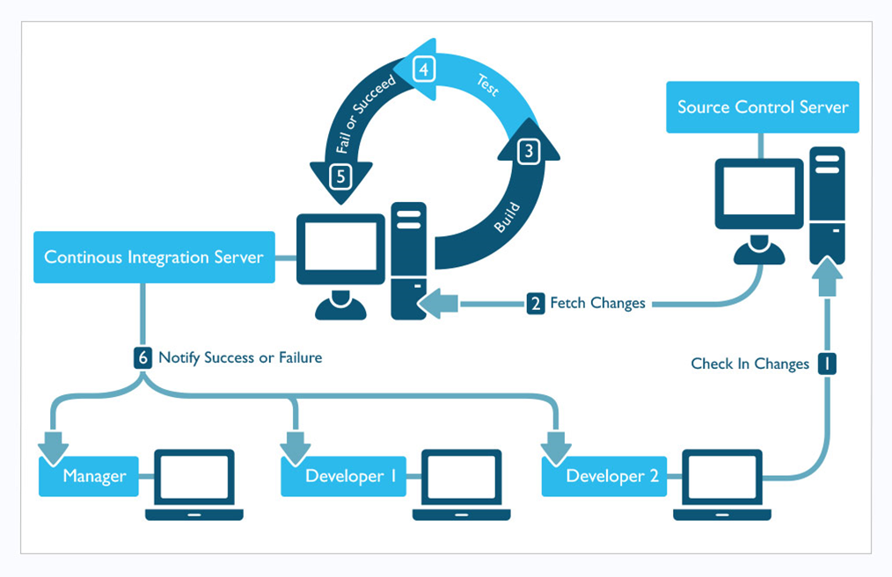
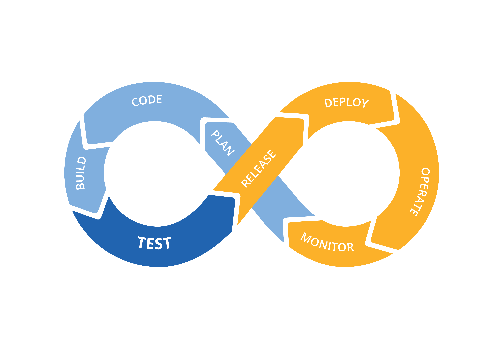

# Built-in Quality Practices

## Lean Startup 

## Walking Skeleton 

## Test-Driven Development (TDD) 

TDD is based on three rules, knows as 'The Three Laws of TDD': 

* You must write a failing test before you write any production code.
* You must not write more of a test than is sufficient to fail, or fail to compile.
* You must not write more production code than is sufficient to make the currently 
  failing test pass.
  
In code, TDD is translated into the cycle Red/Green/Refactor!

(source: https://blog.cleancoder.com/uncle-bob/2014/12/17/TheCyclesOfTDD.html)

The rules of this cycle are as follows: 
* Create a unit tests that fails
* Write production code that makes that test pass. 
* Clean up the mess you just made.

### Benefits
The top 3 advantages of TDD are: 
* Requires in-depth understanding of the what the code should do
* Increases the confidence in changing parts of the code
* Reduces the debugging time  

### Resources 
1. [The Cycles of TDD - CleanCoder](https://blog.cleancoder.com/uncle-bob/2014/12/17/TheCyclesOfTDD.html)
2. [Test-driven development - Wikipedia](https://en.wikipedia.org/wiki/Test-driven_development)

## Behavior-Driven Development (BDD)

BDD is the combination of practices from TDD, Domain Driven Design (DDD) and 
Object-Oriented Design to produce software-development collaboration tools and 
processes. Those tools and practices emphasizes that software development should
be managed by business interest and technical insight. 

### Principles 

#### Testing 
In terms of testing, BDD is considered a continuation of TDD as it puts more 
focus on the desired behavior of the unit. The 'Desired Behavior' consists of 
the requirements defined by the business. 

#### Behavioral Specifications 
The second principle defines how the 'desired behavior' should be written. Here, 
BDD uses the terms 'Scenario' & 'Specification' to gather all requirements and 
expected outcome in a single place that is a User Story. 

Although, there is no official format defined in BDD, there is a preference to 
follow the form 'Given-When-Then'

#### Specification as a ubiquitous language
Ubiquitous Language is defined in DDD. It is a 'semi-formal' language that is 
developed and used by team-members to have common understanding of the discussion 
between them. Thus, reducing the risks of having a communication break-down 
between developers and stakeholders.

### Benefits 
The 3 benefits of BDD are: 
* Guides and organizes the conversation between the different parties of the 
 software development team (developers, testers and domain experts)
* The given-when-then canvas is closer to everyday language
* Tools targeting a BDD approach generally afford the automatic generation 
  of technical and end user documentation from BDD “specifications”
  
### Resources
1. [Behavior Driven Development (BDD) - Agile Alliances](https://www.agilealliance.org/glossary/bdd/)
2. [Behavior-driven development - Wikipedia](https://en.wikipedia.org/wiki/Behavior-driven_development) 

## Continuous Integration (CI) 
Continuous Integration is a process that helps developers detect problems faster
through frequent integration of code to a shared repository. The build, 
regression and acceptance tests are automated and executed at each check-in.

(source: http://www.pepgotesting.com/continuous-integration/)

### Practices 
* Maintain a single source repository
* Automate the build
* Make your build self-testing
* Every commit should build on an integration machine
* Keep the build fast
* Test in a clone of the production environment
* Make it easy for anyone to get the latest executable version
* Everyone can see what’s happening
* Automate deployment

### Benefits 
The 3 benefits of CI are: 
* Generate deploy-able software at any time and at any place
* Shortens the feedback loop and reduces operational, technical & human risks
* Reduces the debugging time 

### Resources 
[CONTINUOUS INTEGRATION - ThoughtWorks](https://www.thoughtworks.com/continuous-integration)
  
## Dev Ops 
DevOps is a set of practices that combines software development (Dev) and 
information-technology operations (Ops) which aims to shorten the systems 
development life cycle and provide continuous delivery with high software quality.

(source: https://guide.freecodecamp.org/devops/)

### Practices
* Coding: Code Development and Review, Source Code Management tools, Code Merging 
* Building: Continuous Integration Tools, Build Status
* Testing: Continuous Testing Tools
* Packaging: Artifact Repository, Application Pre-Deployment Staging
* Releasing: Change Management, Release Approvals, Release Automation
* Configuring: Infrastructure Configuration and Management, Infrastructure as Code Tools
* Monitoring: Applications Performance Monitoring, End-User Experience

### Benefits
The 3 benefits of DevOps are: 
* Faster releases and time to market
* Lower failure rate and downtime 
* Shortened lead time between fixes

### Resources 
[DevOps - Wiki](https://en.wikipedia.org/wiki/DevOps)

## Craftsmanship 
Software craftsmanship is an approach to software development that emphasizes the
coding skills of the software developers. It is a response by software developers
to the perceived ills of the mainstream software industry, including the 
prioritization of financial concerns over developer accountability.

Software craftsmanship came as a continuation for the Agile Framework. Agile 
focuses more individuals, how teams should collaborate, and how should the work
be paced. But, it does not cover quality of the code or the design. Software 
craftsmanship was defined to cover those missing principles, as it ensures that
a software should be both functional and well designed.

### Manifesto 
As aspiring Software Craftsmen we are raising the bar of professional software 
development by practicing it and helping others learn the craft. Through this 
work we have come to value:
* Not only working software, but also well-crafted software
* Not only responding to change, but also steadily adding value 
* Not only individuals and interactions, but also a community of professionals
* Not only customer collaboration, but also productive partnerships

### Serving Agility 
Software Craftsmanship borrows practices from other agile methods: 
• Quality: simple design, DDD, OO, refactoring, TDD (XP)
• Humility: questioning and continuous improvement (retrospectives)
• Sharing: pair programming and collective ownership (XP)
• Pragmatism: I understand the constraints and I adapt (Scrum)
• Professionalism: I treat my client as a partner (XP)

### Resources 
[Software craftsmanship - Wikipedia](https://en.wikipedia.org/wiki/Software_craftsmanship)
[Manifesto for Software Craftsmanship](http://manifesto.softwarecraftsmanship.org/)
[How Software Craftsmanship Completes Agile Methods](https://blog.comet.co/engineering/how-software-craftsmanship-completes-agile-methods/)
